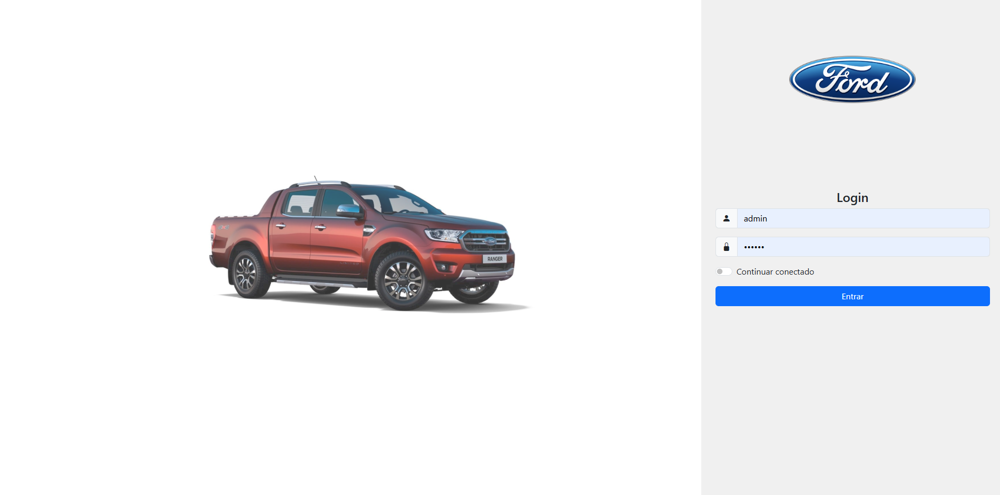
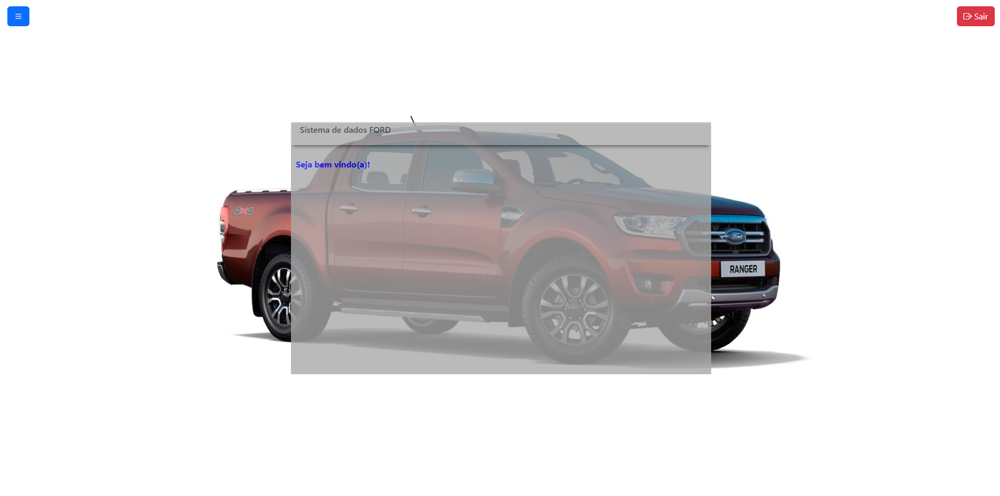
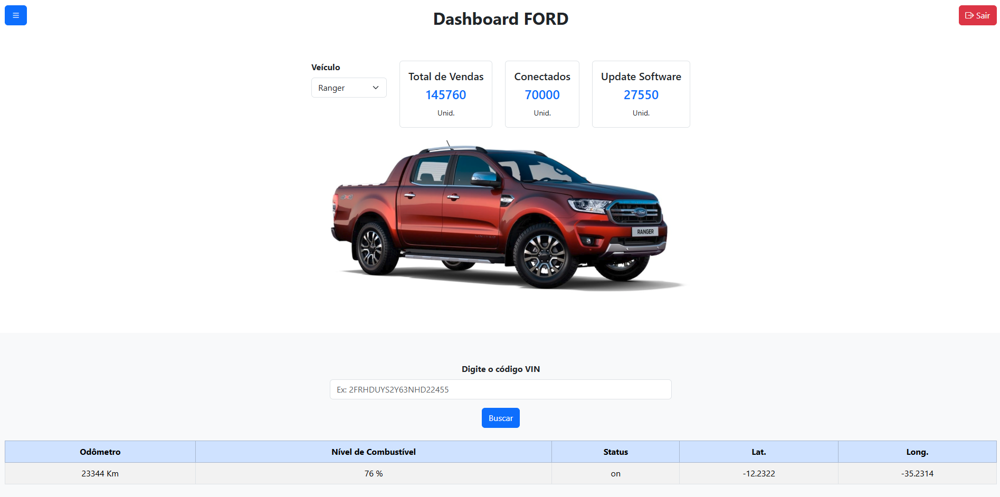

# 🚗 Dashboard FORD

Um sistema web construído com Angular e Bootstrap para visualização dinâmica de dados de veículos da marca FORD. O projeto inclui autenticação de login, cards informativos, busca por VIN, e interface responsiva com menu lateral e tabela técnica.

---

## 📸 Capturas de Tela

   



---

## 🚀 Funcionalidades

- 🔐 **Login com validação**
  - Campo de usuário e senha
  - Opção de "Continuar conectado" com toggle
- 🏚️ **Home**
  - Tela inicio após validação das credencias
  - Funcionalidades do menu lateral e logout
- 📊 **Dashboard dinâmico**
  - Seleção de veículos com `select`
  - Cards com total de vendas, conectados e atualizações
  - Imagem correspondente ao veículo selecionado
- 🔍 **Busca por VIN**
  - Input para digitar o código VIN
  - Tabela com odômetro, combustível, status, localização
- 🎨 **Interface responsiva**
  - Menu lateral (offcanvas)
  - Botão de logout
  - Layout adaptável para desktops e tablets

---

## 🛠️ Tecnologias Utilizadas

- **Angular 19** (Standalone Components)
- **Bootstrap 5.3**
- **TypeScript**
- **HTML5/CSS**
- **API Node.js (Express)**

---

## 🧪 Como Executar

### 🔧 Backend

1. Vá até a pasta `api`
2. Instale as dependências:
   ```bash
   npm install
   ```
3. Inicie o servidor:
   ```bash
   node index.js
   ```
4. A API estará em: `http://localhost:3001`

### 🖥️ Frontend

1. Vá até a pasta do Angular:
   ```bash
   cd desafio_07_ford_angular
   ```
2. Instale as dependências:
   ```bash
   npm install
   ```
3. Inicie o servidor:
   ```bash
   ng serve
   ```
4. Acesse: `http://localhost:4200`

---

## 🧠 Requisitos de Login

- **Usuário:** admin  
- **Senha:** 123456

---

## 📁 Estrutura de Pastas

```
📦 desafio_07_ford_angular
├── src
│   ├── app
│   │   ├── pages
│   │   │   ├── login
|   |   |   ├── home
│   │   │   ├── dashboard
│   ├── assets
│   │   └── img/
├── api
│   └── index.js
```

---

## 🏁 Melhorias Futuras

- [ ] Criptografia de sessão/localStorage
- [ ] Implementar gráficos com Chart.js
- [ ] Autenticação com JWT
- [ ] Footer fixo em tela cheia com rolagem

---

## 👨‍💻 Desenvolvido por

**Marcos Vinicius Silva De Santana Junior**  
Técnico em Informática • Estudante de Ciência e Tecnologia (UFBA)  
[GitHub](https://github.com/Mavisi)
